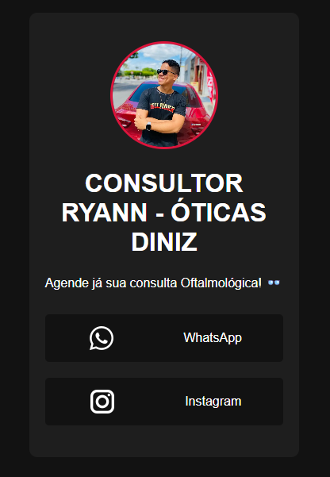

# LinkTree para Consultor Ryann - Óticas Diniz

Este é um projeto de LinkTree criado para o Consultor Ryann, representando as Óticas Diniz. O LinkTree permite que os usuários acessem rapidamente o WhatsApp e o Instagram do consultor para agendar consultas oftalmológicas.

## Pré-visualização




## Tecnologias Utilizadas

- **HTML5**: Estruturação do conteúdo.
- **CSS3**: Estilização e layout da página.
- **Flexbox**: Utilizado para centralização e alinhamento de elementos.
- **Ícones**: Ícones externos de WhatsApp e Instagram.

## Funcionalidades

- **Imagem de Perfil**: Exibe uma imagem de perfil do consultor.
- **Links de Contato**: Fornece links para o WhatsApp e Instagram do consultor, permitindo fácil acesso para agendamentos.

## Como Usar

1. Clone o repositório:

   ```bash
   git clone https://github.com/seu-usuario/linktree-ryann.git
